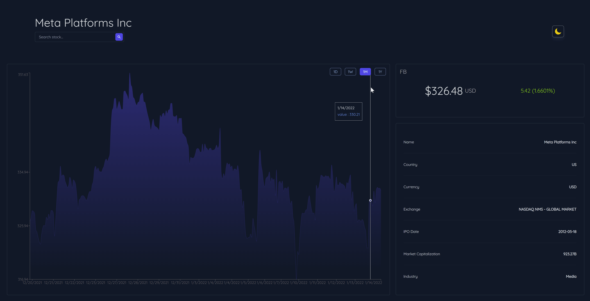

# Stock Data Dashboard

This project is a stock dashboard app that uses the [Finnhub API](https://finnhub.io/)

## Built With
 - React.js
 - Tailwind CSS
 - Finnhub API

## Features

- 🔍 Search for a stock (e.g. AAPL, FB, GOOG)

- 💸 Quote a stock (current price, percent change)

- 📝 Get more details of a stock (name, currency, market cap, etc.)

- 📈 View historical chart data of a stock (day/week/month/year)

- 🌙 Select theme (dark/light)

### Search

### Date Filter

### Select Theme

## Getting Started

To get a local copy up and running follow these simple example steps.

### Prerequisites

- Code Editor
- Git installed
- Node js installed

### Setup

- To clone the repository run `https://github.com/ShingiraiBhengesa/stock-data-dashboad.git` in your terminal
- Next run `npm install` to install dependances
- To run the project run `npm start` this will open your web browser on localhost:3000

### Run tests

- Run `npm test` to jest test results

## Author

👤 **Shingirai**

- GitHub: [@ShingiraiBhengesa](https://github.com/ShingiraiBhengesa)
- Twitter: [@bhengesa](https://twitter.com/twitterhandle)
- LinkedIn: [Shingirai Bhengesa](https://www.linkedin.com/in/shingirai-bhengesa-612b09206/)

## 🤝 Contributing

Contributions, issues, and feature requests are welcome!

Feel free to check the [issues page](../../issues/).

## Show your support

Give a ⭐️ if you like this project!

## Acknowledgments

- Hat tip to anyone whose code was used
- Inspiration
- etc

## 📝 License

This project is [MIT](./MIT.md) licensed.

